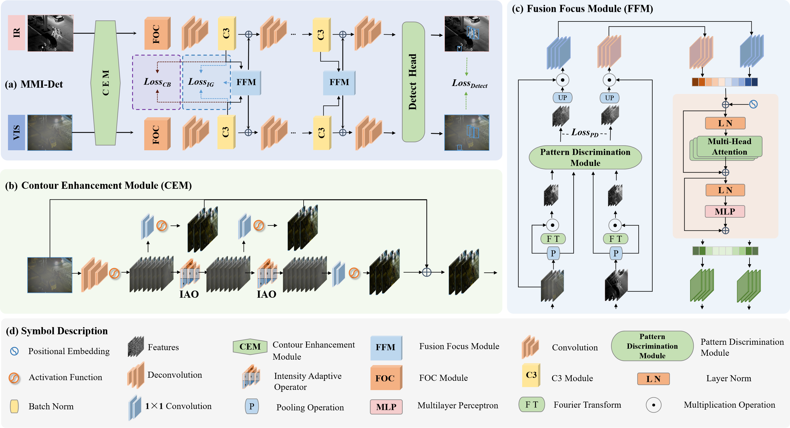

# MMI-Det: Exploring Multi-Modal Integration for Visible and Infrared Object Detection


This repository is an official implementation of the paper [MMI-Det: Exploring Multi-Modal Integration for Visible and Infrared Object Detection](https://ieeexplore.ieee.org/abstract/document/10570450).


## Introduction

Image fusion aims to combine images from different sources to produce a fused image that contains important information from multiple sources. In real scenarios, not every sample has paired images, and there are some unpaired single-modal samples. How to reconstruct the missing modal images from unpaired images and accomplish image fusion becomes an important challenge. In this paper, we propose DDM-Fusion, a Denoising Diffusion Model for unpaired image fusion in real world, which can rebuild the missing modality and output the fused image end-to-end. Specifically, to reconstruct the missing image of the unpaired image, we design the Supported Images Retrieval Strategy, which uses paired images as ``bridges" and the large vision-language model to find similar supported images. Furthermore, to produce high-quality missing images and fusion images, we design a diffusion model-based image fusion model to bringing missing image reconstruction and image fusion into a unified framework. Finally, to overcome the lack of supervised labels required for training diffusion models in the image fusion task, we propose Image Fusion Prior, which designs a multi-task evaluation method to obtain high-quality labeled data, thereby enhancing the optimization of image fusion. Extensive experiments on public datasets, including M3FD, TNO, and LLVIP, demonstrate that our method effectively handles the task of fusing unpaired images in real-world scenarios.

<br/>
<div align="center">
  

  Fig. 1: Overall architecture of the proposed MMI-Det model.
</div>


## Citing EDCNN
If you find MMI-Det useful in your research, please consider citing:
```bibtex
@ARTICLE{10570450,
  author={Zeng, Yuqiao and Liang, Tengfei and Jin†, Yi and Li, Yidong},
  journal={IEEE Transactions on Circuits and Systems for Video Technology}, 
  title={MMI-Det: Exploring Multi-Modal Integration for Visible and Infrared Object Detection}, 
  year={2024},
  volume={},
  number={},
  pages={1-1},
  keywords={Feature extraction;Image fusion;Object detection;Task analysis;Optimization;Circuits and systems;Data mining;multi-spectral object detection;multi-modal integration;image fusion;Fourier transformation},
  doi={10.1109/TCSVT.2024.3418965}}
```


## License

This repository is released under the Apache 2.0 license. Please see the [LICENSE](./LICENSE) file for more information.
